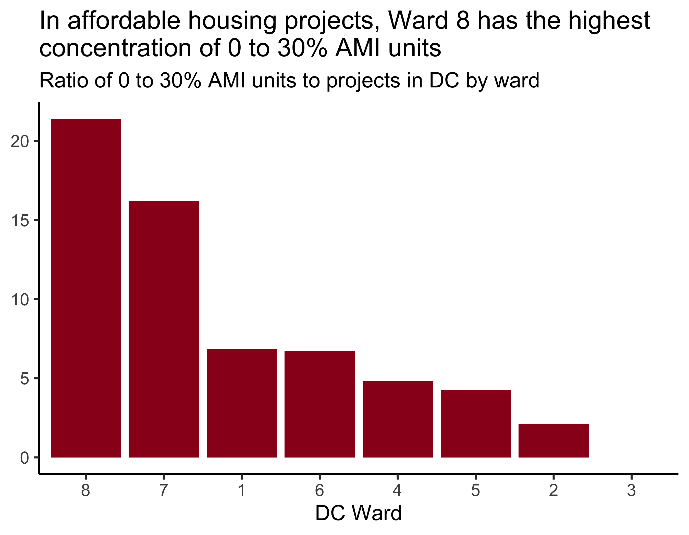
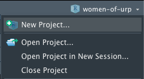
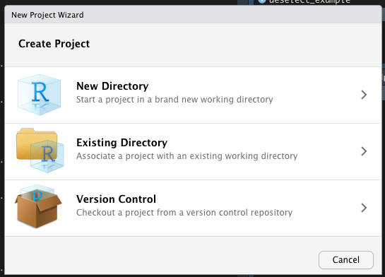

```{r setup, include = FALSE, warning = FALSE}
options(htmltools.dir.version = FALSE)

library(xaringanthemer)
library(emo) # github.com/hadley/emo
style_mono_accent(
  base_color = "#3d405b",
  header_font_google = google_font("Rubik"),
  text_font_google   = google_font("Roboto", "300", "300i"),
  text_font_size = "1.2rem",
  code_font_google   = google_font("Fira Mono"),
  extra_css = list(
    ul = list("font-size" = "1.6rem",
              "line-height" = "2.2rem")
  )
)

hook_source <- knitr::knit_hooks$get('source')
knitr::knit_hooks$set(source = function(x, options) {
  x <- stringr::str_replace(x, "^[[:blank:]]?([^*].+?)[[:blank:]]*#<<[[:blank:]]*$", "*\\1")
  hook_source(x, options)
})

```

# What is data science?

#### *"Data science is an exciting discipline that allows you to turn raw data into understanding, insight, and knowledge."* - R for Data Science

#### Five steps to data science:
1. Capture data
2. Maintain data
3. Process data
4. Analyze data
5. Communicate data

Engineers do the first two steps (capture and maintain). **Don't worry about those.**

Statisticians do the third step (process). **Don't worry about this.**

Analysts do steps four and five (analyze and communicate). *You are already doing this!*

---

# What is code/programming?

- Data science heavily focuses on code.
- If you type in directions into your computer, you are coding.
    - Yes, even in Excel!
- If you are writing multiple steps of code, you are programming.
- People are use these interchangeably - you can too.

---

# Why code or program?

- Code is text
    - copy and paste!!
- Code is read-able
    - read your code days, weeks, months later
    - check your work/someone else's work
    - understand unfamiliar processes step-by-step
- Code is share-able
    - put it on GitHub, someone can use your work
    - learn from others' work
- Code is open
    - FREE (which means inclusive)

---

# Why on earth would we use this for planning?

- You are around more data than you think
- Speed up repetitive processes
    - Received 112 Excel files all at once
- Spreadsheets have limitations
- Not all data lives in spreadsheets

---

# Pep Talk

- This is a skill you can tackle
- You do not need to be a genius to get it
- You do not need to struggle on your own
- Today, let's have the confidence of a mediocre white man

---

# What is R?

- Doesn't stand for anything
- It's a language
- It's also an "environment" or system
- First built for statistics
- Install packages to extend R (for example, these slides!)

---

# Why use R over other options?

- Easy to install and keep updated
- Language is easy to read
- Great at building charts and graphs
- **R has a fantastic community for women**

---
class: inverse, center, middle

# Refresher

---

# Pre-work Refresher:

- Installed **R** and **R Studio**

--
- Learned about **Projects** and **File types**

--
- Installed **Packages**

--
- Imported a **CSV** using `read_csv()`

--
- Learned the difference between **Objects** and **Functions**

--
- Examined data using `head()`, `tail()`, `View()`, and `skim()`

---

# Goal for Lesson:

```{r, echo=FALSE, out.width="50%"}

```

*But if we don't get all the way here, that's okay too*

---

# Create a new project

 



---

# Download data and put in project

Source: https://opendata.dc.gov/datasets/affordable-housing


---

# Open a new script

- Windows: Ctrl + N

- Mac: Shift + ⌘ + N

---

# Add `tidyverse` to the script

```{r}
library(tidyverse)

```


---

# Import new data via `read_csv()`

```{r, message = FALSE}

aff_housing <- read_csv("Affordable_Housing.csv")

```

---

# Examine your data

- `head()` and `View()` are great!
- Rachel likes `glimpse()` because all columns are shown

```{r}

glimpse(aff_housing)

```

---

# `skim()` your data

```{r, eval = FALSE}
library(skimr)

skim(aff_housing)
```

---

# We don't need all those columns...

Use `select()` to **select** the columns wanted.

```{r}

aff_housing_2 <- aff_housing %>%
  select(MAR_WARD, PROJECT_NAME, STATUS_PUBLIC, AFFORDABLE_UNITS_AT_0_30_AMI) #<<

glimpse(aff_housing_2)

```

`select()` can also be used to **deselect** columns using the minus sign.

```{r}

deselect_example <- aff_housing %>%
  select(-GIS_LAST_MOD_DTTM) #<<

```

---

class: center, middle

# The Pipe

# `%>%`

---

# %>% means "and then"

```{r, eval = FALSE}

my_data %>%
  this_thing(this_way)

```

Give me `my_data` and then do `this_thing` to it `this_way`.

```{r}

aff_housing_2 <- aff_housing %>%
  select(MAR_WARD, PROJECT_NAME, STATUS_PUBLIC, AFFORDABLE_UNITS_AT_0_30_AMI) 
```

Give me `aff_housing` and then `select` `these columns`.

Save the result as `aff_housing_2`.

---

# Sort alphabetically

Use `arrange()` to **arrange** columns in order.

```{r}

aff_housing_3 <- aff_housing_2 %>%
  arrange(PROJECT_NAME) #<<

head(aff_housing_3)

```

`arrange(desc(column))` can be used to arrange in **descending** order.

```{r}
descending_example <- aff_housing %>%
  arrange(desc(PROJECT_NAME)) #<<
```

---

# Filter 

Let's filter to just rows that are `"Completed 2015 to Date"`.

We removed 243 rows by filtering.

```{r}

aff_housing_4 <- aff_housing_3 %>%
  filter(STATUS_PUBLIC == "Completed 2015 to Date") #<<

glimpse(aff_housing_4)

```

---

# Mutate

Let's get rid of the repetitive "Ward" label.

```{r}

aff_housing_5 <- aff_housing_4 %>%
  mutate(ward = str_sub(MAR_WARD, start = 6)) #<<

glimpse(aff_housing_5)

```

---

# Sum units by ward

`group_by()` chooses the groups. `summarize()` creates one row per group. `sum()` adds up all the values together.

```{r, message = FALSE}

aff_housing_final <- aff_housing_5 %>%
  group_by(ward) %>%
  summarize(aff_units_0_30 = sum(AFFORDABLE_UNITS_AT_0_30_AMI)) %>%
  ungroup()

aff_housing_final

```
---

# Sum units and count projects

`n()` counts the number of rows per group.

```{r, message = FALSE}

aff_housing_final <- aff_housing_5 %>%
  group_by(ward) %>%
  summarize(aff_units_0_30 = sum(AFFORDABLE_UNITS_AT_0_30_AMI),
            n_projects = n()) %>% #<<
  ungroup()

aff_housing_final

```

---

# Sum units, count projects, and find ratio

```{r, message = FALSE}

aff_housing_final <- aff_housing_5 %>%
  group_by(ward) %>%
  summarize(aff_units_0_30 = sum(AFFORDABLE_UNITS_AT_0_30_AMI),
            n_projects = n(),
            ratio = aff_units_0_30/n_projects) %>% #<<
  ungroup()

aff_housing_final

```

---
class: inverse, center, middle

# 10-minute break

## *remember to save your script!*

---

# Create a column (or bar) chart

{ggplot2} is the package inside {tidyverse}. It uses `+` instead of `%>%`, but they mean the same thing.

ggplot needs three things: data, aesthetics (`aes`), and a geom (`geom_x`). Here we've used `geom_col()` to make a column chart.

```{r, fig.height = 5}

ggplot(aff_housing_final, aes(x = ward, y = ratio)) +
  geom_col()

```

---

# Add a theme

Look at all themes here: https://ggplot2.tidyverse.org/reference/ggtheme.html

```{r, fig.height = 5}

ggplot(aff_housing_final, aes(x = ward, y = ratio)) +
  geom_col() +
  theme_classic(base_size = 20) #<<

```

---

# Add a title and subtitle

```{r, fig.height = 4.5, fig.width = 9}

ggplot(aff_housing_final, aes(x = ward, y = ratio)) +
  geom_col() +
  theme_classic(base_size = 20) +
  labs(title = "In affordable housing projects, Ward 8 has the highest concentration of 0 to 30% AMI units",
       subtitle = "Ratio of 0 to 30% AMI units to projects in DC by ward",
       x = "DC Ward",
       y = NULL)

```

---

# Add a pretty color

```{r, fig.height = 4.5, fig.width = 9}

ggplot(aff_housing_final, aes(x = ward, y = ratio)) +
  geom_col(fill = "#3d405b") + #<<
  theme_classic(base_size = 20) +
  labs(title = "In affordable housing projects, Ward 8 has the highest concentration of 0 to 30% AMI units",
       subtitle = "Ratio of 0 to 30% AMI units to projects in DC by ward",
       x = "DC Ward",
       y = NULL)

```


---

# Arrange by most to least

- This is considered a best practice but is a little technical
- If you get lost here, it's okay.

```{r, eval = FALSE}

aff_housing_final %>%
  mutate(ward = fct_reorder(ward, ratio, .desc = TRUE)) %>% #<<
  ggplot(aes(x = ward, y = ratio)) +
  geom_col(fill = "#3d405b") + 
  theme_classic(base_size = 20) +
  labs(
    title = "In affordable housing projects, Ward 8 has the highest concentration of 0 to 30% AMI units",
    subtitle = "Ratio of 0 to 30% AMI units to projects in DC by ward",
    x = "DC Ward",
    y = NULL
  )

```

---

# Arrange by most to least

```{r, echo = FALSE, fig.width = 9}

aff_housing_final %>%
  mutate(ward = fct_reorder(ward, ratio, .desc = TRUE)) %>%
  ggplot(aes(x = ward, y = ratio)) +
  geom_col(fill = "#3d405b") + 
  theme_classic(base_size = 20) +
  labs(
    title = "In affordable housing projects, Ward 8 has the highest\nconcentration of 0 to 30% AMI units",
    subtitle = "Ratio of 0 to 30% AMI units to projects in DC by ward",
    x = "DC Ward",
    y = NULL
  )

ggsave("screenshots/final_chart.png")

```

---
# Get Help

- I am now required to help you `r emo::ji("smile")`
- R-Ladies Slack: rladies-community.slack.com
- R for Data Science Slack: rfordatascience.slack.com

---

## Learn More

- R for Data Science book (free)
    - <https://r4ds.had.co.nz/>
- R for Reproducible Scientific Analysis (free)
    - <https://swcarpentry.github.io/r-novice-gapminder/>
- \#rstats on Twitter
- Watch screencasts on YouTube
    - <https://www.youtube.com/user/safe4democracy/videos>
- Cheatsheets from RStudio (free reference)
    - <https://www.rstudio.com/resources/cheatsheets/>
    
---

## More packages to try out

- `readxl` - import Excel files
- `tidycensus` - quickly download Census data (love this)
- `sf` - spatial analysis
- `tigris` - quickly download TIGER shapefiles

